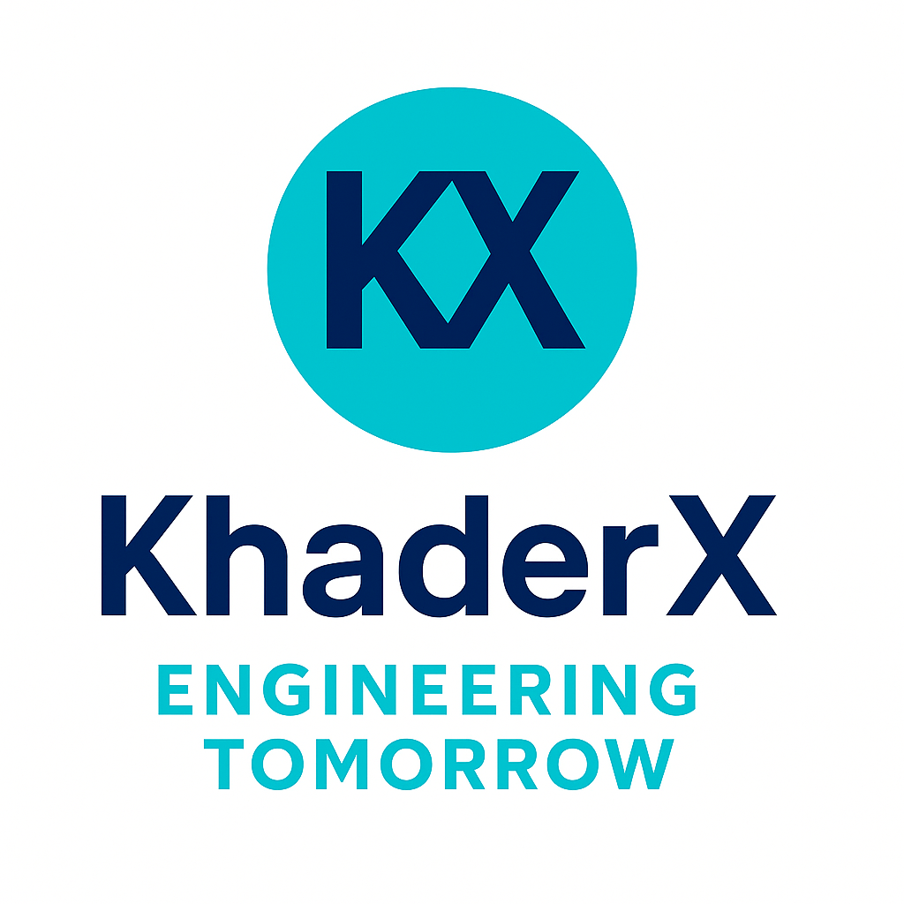

  

  # KhaderX

  **Engineering Tomorrow**

  *Aerospace and Aeronautical Engineer, University of Liège. Passionate about Python Dev. , Scientific computing and Flutter - Dart (Mobile & Desktop Apps Dev.)*

  [🌐 Live Website](https://khaderx.com) • [📧 Contact](mailto:contact@khaderx.com) • [💼 LinkedIn](https://www.linkedin.com/in/khader-abueltayef-924641301/)

---

## 📋 About

KhaderX is a professional portfolio website showcasing the work and expertise of Khader ABUELTAYEF, an Aerospace and Aeronautical Engineer, Python and Flutter - Dart (Mobile & Desktop Apps Dev.) Developer. The site features a modern, responsive design built with cutting-edge web technologies.

### 🎯 Mission
To bridge the gap between aerospace, aeronautical, mechanical and day-to-day engineering and software development, delivering innovative solutions that push the boundaries of technology.

---

## ✨ Features - Website Highlights

- **🏠 Modern Landing Page** - Eye-catching hero section with professional branding
- **👤 Comprehensive Contact Page** - Detailed personal information, education, skills, and professional links
- **🛠️ Services Preview** - Coming soon page for professional services
- **📁 Projects Showcase** - Portfolio of technical projects (coming soon)
- **📱 Fully Responsive** - Optimized for all devices and screen sizes
- **🎨 Brand Consistent** - Adheres to KhaderX branding guidelines
- **⚡ Fast & Optimized** - Built with modern web technologies for optimal performance

---

## 🎨 Branding Guidelines

### Color Palette
- **Primary Deep Blue**: `#0A2540` - Headers, navigation, main text
- **Accent Cyan**: `#00C2FF` - Buttons, highlights, links
- **Neutral Light Gray**: `#F5F7FA` - Backgrounds, sections
- **Text Dark Charcoal**: `#1A1A1A` - Body text, contrast

### Typography
- **Primary Font**: Sans-serif, Geometric Modern (Poppins, Montserrat, Inter)
- **Logo Font**: Custom-styled **KX** monogram in bold geometric sans-serif

---

## 🤝 Connect

**Khader ABUELTAYEF**
- **Email**: contact@khaderx.com
- **LinkedIn**: [khader-abueltayef-924641301](https://www.linkedin.com/in/khader-abueltayef-924641301/)
- **GitHub**: [KhaderX-com](https://github.com/KhaderX-com)

---

  
<strong>Engineering Tomorrow</strong>

  
<em>Built with passion and precision</em>

