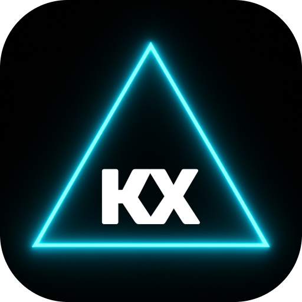

  

# KhaderX

**Engineering Tomorrow** - Professional portfolio website showcasing aerospace engineering expertise and software development services.

## Overview

Modern, responsive website built with Next.js, featuring professional services in web development, mobile applications, engineering software, and performance optimization.

## Tech Stack

- **Framework**: Next.js 14 with TypeScript
- **Styling**: Tailwind CSS
- **Components**: React with modern UI patterns
- **Deployment**: Optimized for production

## Features

- Responsive design across all devices
- Professional service portfolio
- Contact and consultation pages
- SEO optimized
- Modern UI/UX with smooth animations

## Contact

**Website**: [khaderx.com](https://khaderx.com)  
**Email**: contact@khaderx.com  
**LinkedIn**: [khader-abueltayef-924641301](https://www.linkedin.com/in/khader-abueltayef-924641301/)
